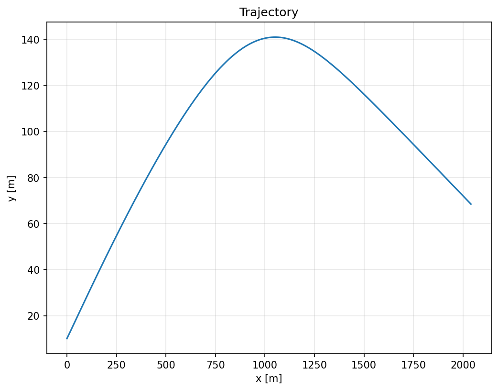
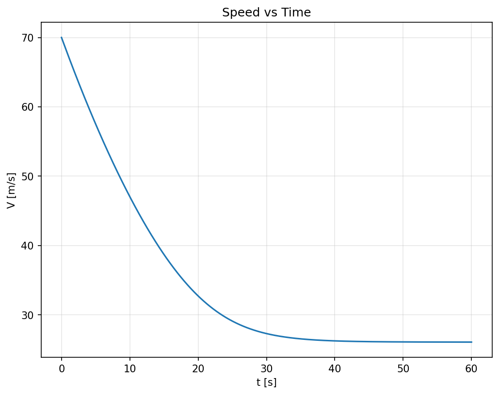

# Aircraft Flight Path Simulation with Aerodynamic Drag

---

## Table of Contents
- [Overview](#overview)
- [Skills Demonstrated](#skills-demonstrated)
- [Tools Used](#tools-used)
- [Simulation Model](#simulation-model)
- [Features](#features)
- [File Structure](#file-structure)
- [Results (Placeholders)](#results-placeholders)
- [Performance Metrics](#performance-metrics)
- [How to Run](#how-to-run)
- [CLI Usage](#cli-usage)
- [Future Improvements](#future-improvements)
- [License](#license)

---

## Overview
This project simulates 2-D aircraft motion under aerodynamic drag using a physics-based dynamic model and numerical integration. It includes a command-line interface for running scenarios and (optionally) real-time visualization for quick inspection and validation.

---

## Skills Demonstrated
**Python simulation, aerodynamic modeling, CLI development, scientific visualization, performance analysis**

---

## Tools Used
**Python, NumPy, SciPy, Matplotlib**

---

## Simulation Model
- **State**: planar position and velocity (2-D)
- **Forces**: gravity, aerodynamic drag (and optional lift if configured)
- **Integration**: fixed-step or SciPy RK methods
- **Outputs**: time histories of position, velocity, speed, and derived KPIs (e.g., L/D, range)

---

## Features
- **Python-based simulation** to evaluate aerodynamic drag and **energy efficiency** across a flight segment.  
- **Matplotlib real-time visualization** option for trajectory and speed validation during runs.  
- **Iterative testing hooks** (configurable params & saved baselines) to **improve model accuracy**.

These map directly to the corresponding bullet points on my resume.

---

## File Structure

'''
flight-sim-2d/
├─ scripts/
│  └─ run_sim.py                  # entry point for quick runs
├─ src/
│  └─ flight2d/
│     ├─ __init__.py
│     ├─ aero.py
│     ├─ atmosphere.py
│     ├─ constants.py
│     ├─ dynamics.py
│     ├─ forces.py
│     ├─ integrators.py
│     ├─ viz.py
│     └─ cli.py                  # CLI driver (python -m flight2d.cli)
├─ figures/
│  ├─ baseline_traj.png          
│  └─ baseline_speed.png         
├─ pyproject.toml
├─ .gitignore
└─ README.md
'''

Quick links: [`scripts/run_sim.py`](scripts/run_sim.py) • [`src/flight2d/cli.py`](src/flight2d/cli.py)

---

## Results (Placeholders)
> Replace the commented image tags below with live figures when ready (remove `<!--` and `-->`).

| Trajectory (Position) | Speed vs Time |
|---|---|
| <!--  --> | <!--  --> |

**Notes (example text to keep):**
- *Trajectory:* shows 2-D flight path under gravity and drag.  
- *Speed:* decays over time as aerodynamic drag reduces velocity; the deceleration rate decreases as speed drops.

---

## Performance Metrics
Representative KPIs from a baseline run:

| Metric | Value |
|---|---:|
| Max Altitude (m) | **141.06** |
| Total Range (m) | **2039.78** |
| Time Aloft (s) | **60.00** |
| Max L/D | **12.13** |
| Energy per meter (J/m) | **903.90** |

*(Values sourced from the project’s baseline meta output.)*

---

## How to Run

### Option A — Pip (widest compatibility)
```bash
# 1) Create & activate a virtual environment
python -m venv venv
# macOS/Linux:
source venv/bin/activate
# Windows (PowerShell):
# .\venv\Scripts\Activate.ps1

# 2) Install the project in editable mode
pip install -e .

# 3) Run a baseline simulation
python scripts/run_sim.py
